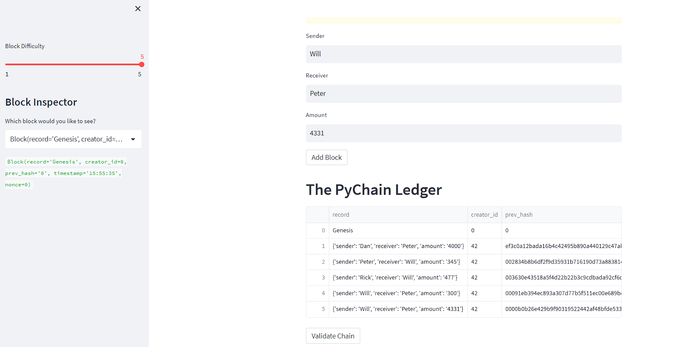
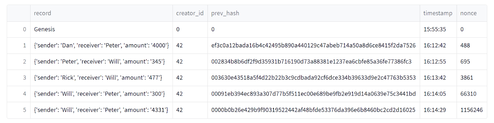
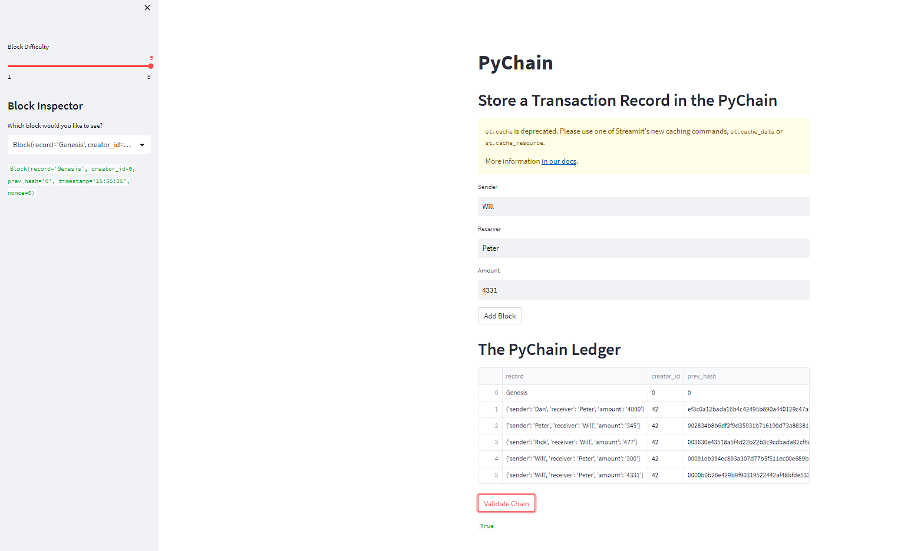

# Blockchain Ledger
This project creates blocks containing transaction data and stores them in a chain. Contents of each block are hashed and the validity of each blocked is verified by including the hash of the previous block as a parameter. This application runs on streamlit.

## Technologies
This application runs on streamlit.
The program uses the pandas and streamlit libraries.

## Installation Guide
Install python 3.7.15. 

To install the latest version of streamlit use the following command on your terminal application:

pip install streamlit

Pandas can be installed by downloading the Anaconda python distribution and following the installation instructions.

## Usage
Navigate to the directory containing the pychain.py file using your terminal.  Then, type 'streamlit run pychain.py'  

Transactions can now be added to the blockchain. Input a sender, and receiver as well as an amount.    
The blockchain can be validated using the validate chain button, and the result will be printed on the bottom of the page 

## Contributors

By Brian Wander
brianwander101@gmail.com
www.linkedin.com/in/brian-wander

---

## License

MIT license.
